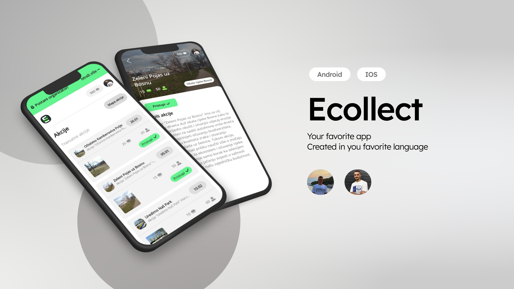

_📌 ECOllect - Ekološka mobilna aplikacija  
📍 Zenica, 2025  
🛠 Tehnologije: .NET, Visual Studio, JetBrains Rider, MAUI, GitHub  
👥 Autori: Adnan Šemić & Ahmed Spahić_  
   
**📖 Opis aplikacije**  
ECOllect je mobilna aplikacija koja motiviše korisnike da učestvuju u ekološkim akcijama kroz sistem nagrađivanja poenima.

**🔹 Ključne funkcionalnosti:**  
✔️ Registracija i prijava korisnika  
✔️ Prikaz liste i mape ekoloških akcija  
✔️ Prijava i odjava sa akcija  
✔️ Sistem poena i nagrada  
✔️ Shop za korištenje poena

**👥 Uloge**  
👤 Korisnik  
✅ Kreira račun putem forme za registraciju  
✅ Pregledava listu ili mapu radnih akcija u svom regionu  
✅ Prijavljuje se na akcije klikom na dugme  
✅ Skuplja poene kroz učešće u akcijama i koristi ih za nagrade

📌 Organizator  
✅ Kreira radne akcije sa svim potrebnim detaljima  
✅ Vodi evidenciju prisustva na akcijama

🏆 Sponzor  
✅ Pregledava nadolazeće radne akcije  
✅ Unosi proizvode u aplikaciju koji se mogu kupiti korisničkim poenima

**🚀 Funkcionalnosti aplikacije**  
🔑 Registracija i prijava  
📌 Korisnici mogu kreirati račun ili se prijaviti na postojeći.

📅 Lista i mapa radnih akcija  
✅ Lista prikazuje osnovne informacije o akcijama (naziv, datum, poeni, broj učesnika).  
✅ Mapa sa markerima prikazuje lokacije svih akcija u blizini korisnika.  
✅ Prijava na akcije  
✅ Korisnici se prijavljuju klikom na dugme  
✅ Mogu otkazati prijavu do 24h prije početka akcije

🏅 Sistem poena  
✅ Korisnici zarađuju poene za učešće u akcijama  
✅ Poeni se koriste za kupovinu nagrada

🛍️ Shop
✅ Korisnici kupuju proizvode koristeći poene  
✅ Detaljni prikaz proizvoda sa opisom i slikama

**📊 Analiza tržišta**  
🚨 Problem  
❌ Nedostatak motivacije i nagrada za učešće u ekološkim akcijama  
❌ Slaba svijest zajednice o lokalnim ekološkim problemima

🎯 Ciljna publika  
Korisnici: Ekološki svjesni pojedinci  
Organizatori: Ekološke organizacije i lokalne vlasti  
Sponzori: Kompanije koje žele promovisati proizvode kroz društveno korisne projekte

**🎯 Prednosti ECollecta**  
✅ Sistem poena koji motiviše korisnike  
✅ Jednostavan pregled i prijava na akcije  
✅ Povezivanje zajednice kroz ekološke akcije

**🎨 Okvirno rješenje korisničkog sučelja**  
🏠 Početna stranica  
📌 Lista trenutnih akcija sa osnovnim detaljima  
📌 Dugme za prikaz mape sa označenim akcijama  
📌 Prikaz sponzora sa njihovim artiklima

📍 Mapa akcija  
🗺️ Interaktivna mapa sa markerima za lokacije akcija  
📌 Klik na marker otvara detalje akcije

📃 Detalji akcije  
📌 Opis akcije, datum, broj učesnika, dodijeljeni poeni  
📌 Dugme za prijavu ili odjavu sa akcije

👤 Profil korisnika  
📌 Prikaz korisničkih podataka (ime, email, poeni)  
📌 Mogućnost uređivanja podataka i odjave

🏆 Sponzori  
📌 Lista sponzora sa njihovim artiklima  
📌 Detaljan prikaz artikla sa opcijom kupovine
