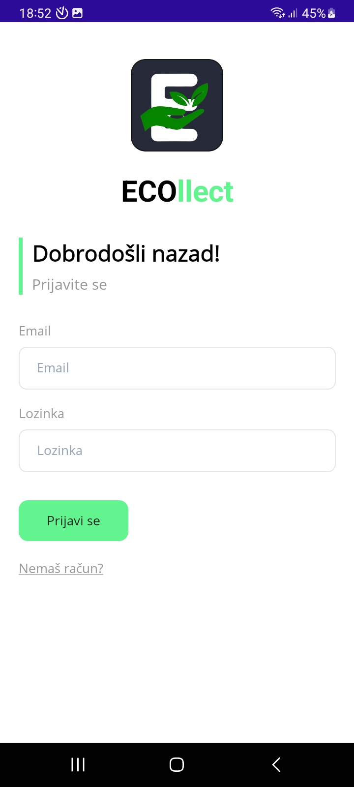
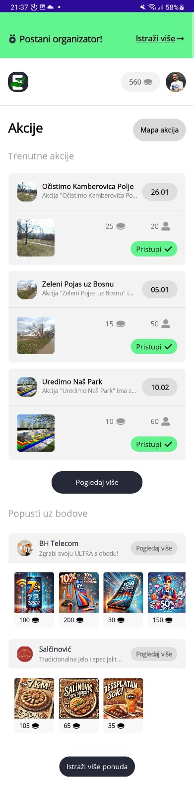
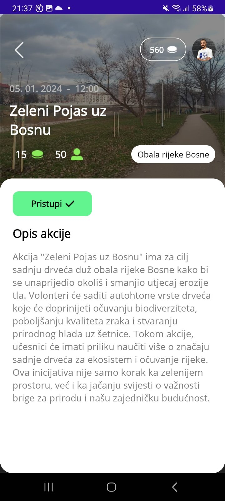
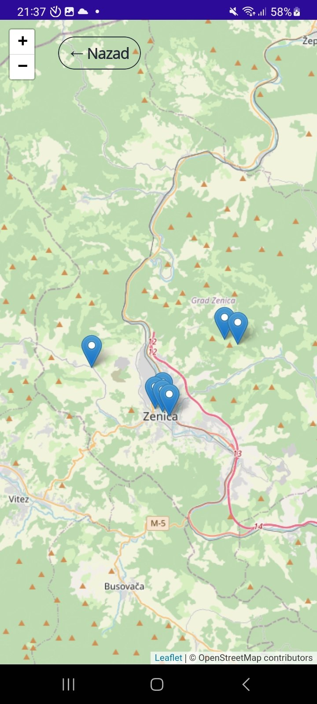
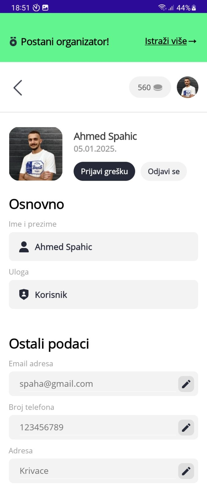

# 🌿 ECOllect - Smart Waste Management & Eco-Engagement App

**ECOllect** is a mobile application designed to encourage community participation in **environmental clean-up actions** through a **point-based reward system**. Users can sign up for eco-actions, track events on a **map**, earn points for participation, and redeem them for sponsored rewards. <br><br>

## 🚀 Features
- 📍 **Interactive Map** – View and sign up for eco-actions near you
- 🏆 **Point System** – Earn points by participating in events and redeem rewards
- 📅 **Event Registration** – Sign up or cancel participation easily
- 🛙 **Sponsor Shop** – Use points to claim rewards from sponsors
- 👤 **User Profiles** – Track personal participation and earned points  

## 🛠️ Tech Stack
- **.NET MAUI** – Cross-platform mobile development  
- **C#** – Backend logic  
- **Firebase** – User authentication and database  
- **Google Maps API** – Location-based eco-actions  
- **GitHub** – Version control  

## 📸 Screenshots  





 

## 🛠️ Installation  
1. Clone the repository:  
   ```bash
   git clone https://github.com/yourusername/ECOllect.git
   cd ECOllect
   ```
2. Open the project in **Visual Studio** or **JetBrains Rider**  
3. Restore dependencies:  
   ```bash
   dotnet restore
   ```
4. Run the application:  
   ```bash
   dotnet run
   ```

## 🎯 Target Audience
- 🌱 **Eco-conscious individuals** looking to contribute to environmental efforts  
- 🏢 **Organizations & local governments** organizing clean-up events  
- 🛒 **Sponsors & companies** promoting sustainability through rewards  

## 👤 Authors  
- **Adnan Šemić** - [GitHub](https://github.com/ShemichAdnan)
- **Ahmed Spahić** - [GitHub](https://github.com/daddyDOT) 


